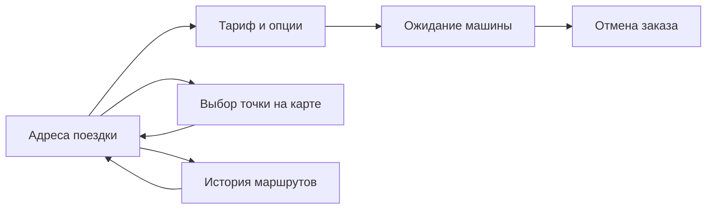

# Taxi App CW

**Учебное Android-приложение для заказа такси**

Java · Android Views / XML · SQLite · Yandex MapKit

Курсовая работа по разработке мобильных приложений, вариант № 3 — «Заказ такси». Проект демонстрирует полный пользовательский сценарий: ввод адресов, выбор тарифа, симуляцию ожидания машины и сохранение истории поездок.

> Это учебная демонстрация. Приложение не вызывает настоящее такси, не подключается к диспетчерской и не выполняет оплату. Статусы заказа меняются по таймеру.

## Возможности

- Ввод адресов вручную, из буфера обмена или через выбор точки на карте.
- Определение точки подачи по последнему известному местоположению устройства.
- Тарифы «Эконом», «Комфорт» и «Бизнес», комментарий и опция детского кресла.
- Экран активного заказа, уведомления о статусе и отмена поездки.
- Локальная история в SQLite, повторный выбор маршрута и очистка истории.
- Повтор последнего маршрута.
- Светлая, тёмная и системная темы, настройка вибрации.

## Сценарий работы



## Технологии

| Компонент | Реализация |
| --- | --- |
| Язык | Java, совместимость исходников Java 11 |
| Интерфейс | XML-разметка, AndroidX AppCompat, Material Components |
| Карты | Yandex MapKit 4.4.0 |
| Геолокация и адреса | FusedLocationProviderClient, Android Geocoder |
| Хранение | SQLiteOpenHelper, SharedPreferences |
| Фоновая работа | Foreground Service, BroadcastReceiver, уведомления |
| Сборка | Gradle Wrapper 9.2.1, Android Gradle Plugin 9.0.1, Kotlin DSL |
| Android | minSdk 24 (Android 7.0), targetSdk 36, compileSdk 36.1 |

## Запуск

1. Клонируйте репозиторий и откройте его корневую папку в Android Studio:

   ```bash
   git clone https://github.com/daniilboriskin21-eng/TaxiAppCW.git
   cd TaxiAppCW
   ```

2. Установите Android SDK Platform 36.1 через SDK Manager. Для Gradle в проекте указан JDK 21 (`gradle/gradle-daemon-jvm.properties`). Версия Java 11 в модуле приложения задаёт совместимость исходного кода.
3. Создайте ключ Yandex MapKit для приложения с идентификатором `ru.danii.taxiappcw`. Добавьте в корневой `local.properties` строку, сохранив существующий `sdk.dir`:

   ```properties
   MAPKIT_API_KEY=your_mapkit_api_key
   ```

   Образец настройки находится в [local.properties.example](local.properties.example). Настоящий ключ хранится только в локальном файле, исключённом из Git. Для автоматической сборки можно передать переменную окружения `MAPKIT_API_KEY`.

4. Выполните Gradle Sync и запустите конфигурацию `app` на устройстве или эмуляторе Android 7.0+. Для определения местоположения нужен образ с Google Play services; для карт и получения адресов — доступ к сети и действующий ключ.
5. Разрешите доступ к точному местоположению. На Android 13+ приложение также запрашивает уведомления.

### Сборка из терминала

Windows PowerShell:

```powershell
.\gradlew.bat :app:assembleDebug
.\gradlew.bat :app:testDebugUnitTest
.\gradlew.bat :app:lintDebug
```

macOS / Linux:

```bash
bash gradlew :app:assembleDebug
bash gradlew :app:testDebugUnitTest
bash gradlew :app:lintDebug
```

Debug APK: `app/build/outputs/apk/debug/app-debug.apk`.

## Структура проекта

```text
app/src/main/
├── java/ru/danii/taxiappcw/
│   ├── MainActivity.java          # Адреса и переход к заказу
│   ├── MapPickerActivity.java     # Выбор адреса на карте
│   ├── TariffActivity.java        # Тариф и параметры заказа
│   ├── ActiveTripActivity.java    # Симуляция ожидания машины
│   ├── HistoryActivity.java       # История маршрутов
│   ├── SettingsActivity.java      # Тема и вибрация
│   ├── TaxiApp.java               # Инициализация MapKit
│   ├── db/                        # SQLite, контракт таблицы, модель
│   ├── receivers/                 # Получатели системных событий
│   ├── services/                  # Сервис с уведомлением
│   └── utils/                     # Настройки и буфер обмена
└── res/                           # Макеты, строки, цвета и темы
```

## Особенности учебной реализации

- Серверная часть, авторизация, расчёт маршрута и стоимости не реализованы.
- Поездка имитируется таймером в Activity; фоновый сервис показывает уведомление и не отслеживает реального водителя.
- Опция «Тихий водитель» присутствует в форме, но пока не передаётся в заказ.
- В репозитории остаются стандартные примеры unit- и instrumented-тестов. Они не подтверждают корректность пользовательских сценариев.
- Работа карт, разрешений, уведомлений и восстановления экрана требует проверки на устройстве. Краткий сценарий проверки — в [docs/verification.md](docs/verification.md).

Проект сохранён как учебная работа и пример использования базовых компонентов Android.
